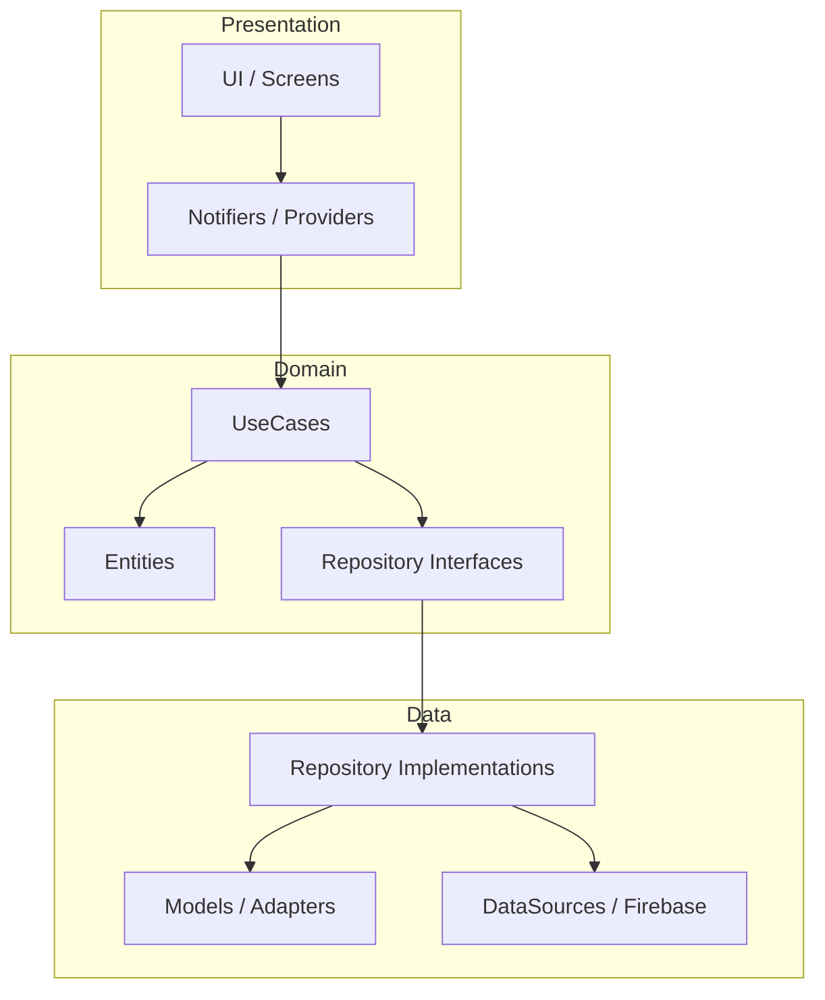

# 🧥 Luxr Clothing - The Ultra-Premium eCommerce Experience

[](https://appdistribution.firebase.google.com/testerapps/1:649656041937:android:754e9f71aa5f619ce860f0/releases/5beppmm2nr7p0?utm_source=firebase-console)
[](https://flutter.dev)
[](https://riverpod.dev)

---

## 🚀 Live Testing & Distribution

> [!TIP]
> **Experience the App Now:**  
> You can download and test the latest production-ready build directly via **Firebase App Distribution**.  
> 👉 **[Download Luxr Clothing APK](https://appdistribution.firebase.google.com/testerapps/1:649656041937:android:754e9f71aa5f619ce860f0/releases/5beppmm2nr7p0?utm_source=firebase-console)**  
> *This is a fully functional APK for Android devices.*

---

## 🔒 Account Security Notice

> [!IMPORTANT]
> **Google Sign-In Status:**  
> To protect your personal account security and maintain the integrity of our development environment, **Google Sign-In has been temporarily disabled**. Please use standard email/password authentication or guest mode to explore the application's features.

---

## ✨ Project Overview

**Luxr Clothing** is a high-performance, AI-driven clothing eCommerce platform built with a focus on **luxury aesthetics** and **architectural excellence**. Designed for scalability and maintainability, it leverages the power of Flutter and a robust Firebase backend.

### 🌟 Key Features

| Feature | Description |
| :--- | :--- |
| **🛍️ Smart Catalog** | Dynamic product discovery with predictive search and categorization. |
| **🛒 Seamless Checkout** | Optimized 1-tap checkout flow with real-time stock validation. |
| **📊 Admin Insights** | Real-time analytics dashboard with revenue tracking and inventory alerts. |
| **🛡️ Clean Architecture** | Strict separation of concerns (Domain/Data/Presentation) for maximum stability. |
| **⚡ Reactive State** | Powered by Riverpod for highly responsive and bug-free UI updates. |
| **🔔 Instant Alerts** | Firebase-driven push notifications for orders and local stock updates. |

---

## 🏛️ Technical Architecture

Luxr Clothing follows **Clean Architecture** principles to ensure a robust and testable codebase.



### 🛠️ Tech Stack

- **Framework:** [Flutter](https://flutter.dev) (v3.24+)
- **State Management:** [Riverpod](https://riverpod.dev) (Notifiers & AsyncNotifiers)
- **Navigation:** [GoRouter](https://pub.dev/packages/go_router)
- **Backend:** [Firebase](https://firebase.google.com) (Auth, Firestore, Storage, Messaging, Analytics)
- **Code Gen:** [Freezed](https://pub.dev/packages/freezed), [JSON Serializable](https://pub.dev/packages/json_serializable)

---

## 🛠️ Developer Setup

### Prerequisites
- Flutter SDK (Latest Stable)
- Android Studio / VS Code
- A configured Firebase Project

### Quick Start
1. **Clone & Install**
   ```bash
   git clone https://github.com/Junaid546/Luxr-Clothing-Store-app-.git
   cd luxr_clothing
   flutter pub get
   ```

2. **Environment Configuration**
   Create a `.env` file in the root directory:
   ```env
   FIREBASE_WEB_API_KEY=...
   FIREBASE_PROJECT_ID=...
   FREE_SHIPPING_THRESHOLD=100
   ```

3. **Run Dev Environment**
   ```bash
   flutter run --debug
   ```

---

## 📂 Project Structure

```bash
lib/
├── app/          # App-wide routing, theme, and entry points
├── core/         # Shared utilities, constants, and error handling
├── features/      # Modular business features (Auth, Products, Cart, Admin)
│   ├── [feature]/ # Domain-driven sub-structure
│   │   ├── data/          # Models & Repository Impl
│   │   ├── domain/        # Entities & UseCases
│   │   └── presentation/  # Screens & Providers
└── shared/       # Cross-feature reusable widgets
```

---

## 👤 Author & Contribution

**Managed by High-Level Professional Developers.**  
Luxr Clothing is an open-source demonstration of modern mobile engineering. 

*License: MIT | Luxr Clothing © 2026*
